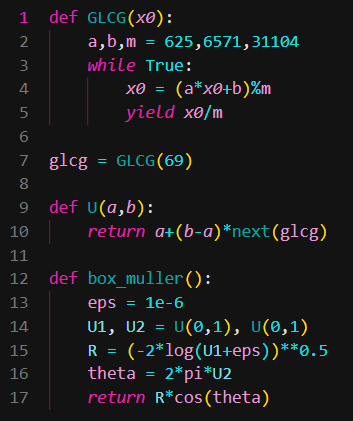
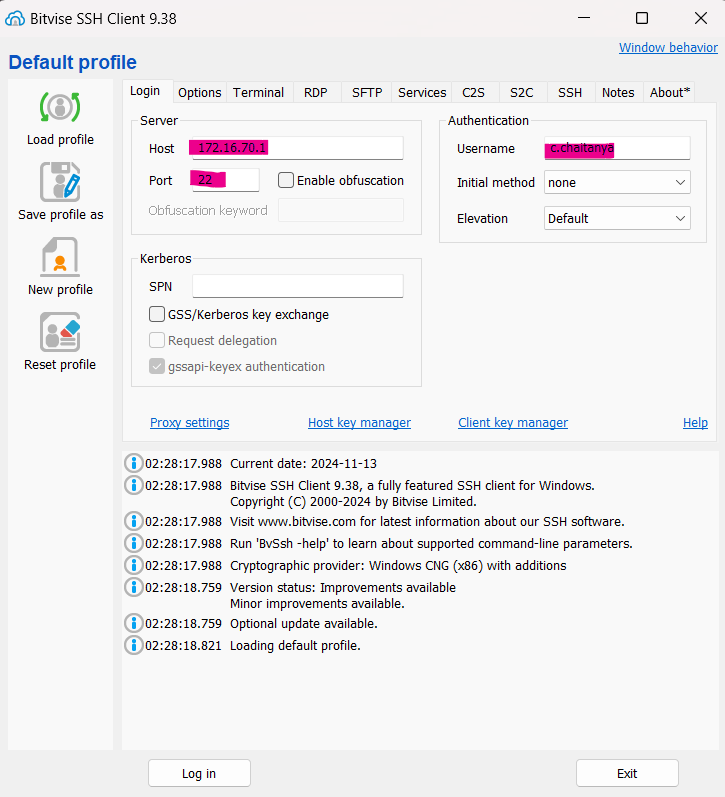
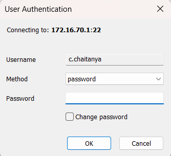
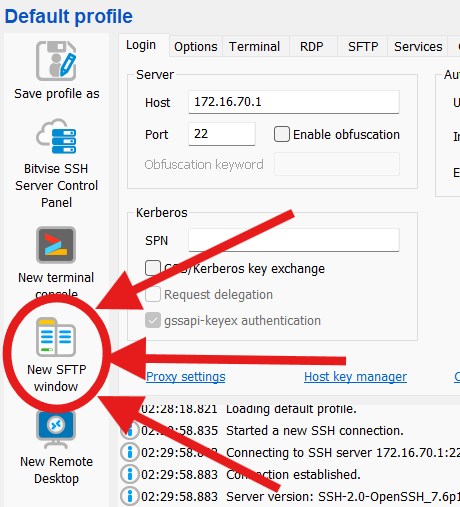

# Solution notebooks for MA323 Monte Carlo Simulation lab

Winter Semester 2024.

<h3>

When the
  
the GLCG

</h3>

## Week 1: Skip (1% chalta hai)

## Week 2: Inverse Transforms

## Week 3: Acceptance Rejection

## Week 4: Normal Distribution

## Week 5: Binormal Distribution

## Week 6: Confidence Intervals

## Week 7: Variance Reduction: Antithetic

## Week 8: Variance Reduction: Control Variable, Conditional Method, Stratification 

## Week 9: Brownian Recursions

## Week 10: Real Stock Prediction, Jump Process Recursion

## Week 11: Quasi Monte Carlo: Van der Carput

# How to not panic running SSH for the first time:

### 1. Install Bitvise SSH

### 2. Tamper with these fields

### 3. Hit login.

Password was `btech22` back in my day. Wonder what yours could be.

### 4. SFTP

### 5. ???

### 6. Profit.